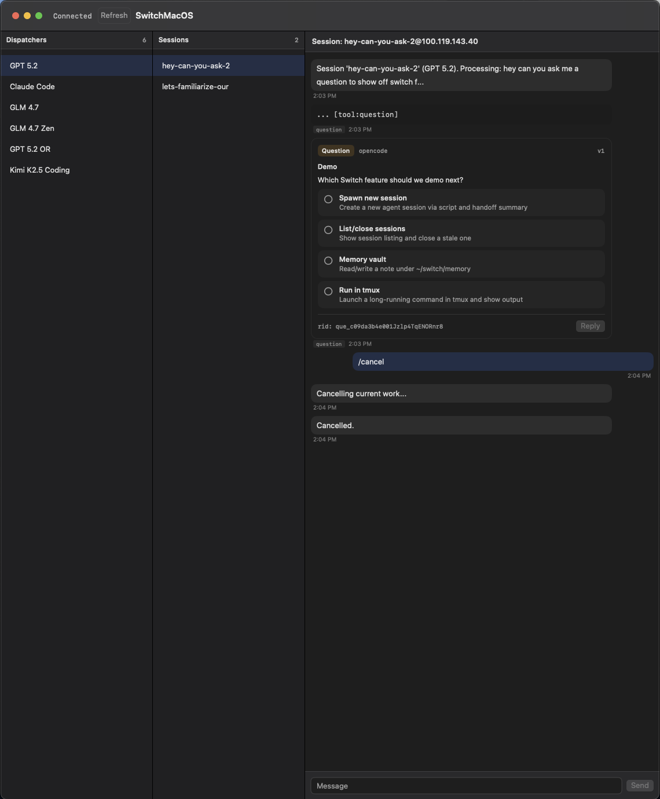

# switch-mac-os

> **Note:** This project is vibe coded and heavily WIP. Expect rough edges, breaking changes, and incomplete features.

## Overview

A custom macOS XMPP client built with SwiftUI using the **Tigase Martin** library. It renders a 2-column directory (Dispatchers/Sessions) and keeps a chat panel always visible.

## Screenshot



## Architecture

### Two-Column Directory + Always-Visible Chat

| Pane | Content | Behavior |
|------|---------|----------|
| **1** | Dispatchers | Selecting loads Sessions + opens dispatcher chat |
| **2** | Sessions | Selecting opens 1:1 chat + loads history |
| **Chat** | Chat panel | Always visible; shows welcome state when no chat target |

### Selection Behavior

- **Dispatcher selection** drives the Sessions list
- Clicking a dispatcher → shows only that dispatcher's sessions in Column 2
- Clicking a session → opens 1:1 chat and loads history
- Chat panel shows the current chat target

### Chat Panel

- **Always visible** on the right side of the sidebar
- Shows **welcome/empty state** when nothing is selected (subtle design)
- Displays **1:1 chat** when a session is selected
- Displays **1:1 chat** when a dispatcher is selected
- Auto-scrolls to the latest message
- Renders Markdown formatting (bold, inline code, code blocks, lists)
- **Message timestamps** displayed subtly below each message
- **Typing indicators** show when contact is composing

## Features

### Message Metadata (Custom XMPP Extension)

The client supports a custom message metadata extension for rich rendering:

```xml
<meta xmlns="urn:switch:message-meta" type="..." tool="..." />
```

**Supported meta types:**

| Type | Rendering |
|------|-----------|
| `tool` | Monospace code block style |
| `tool-result` | Monospace code block style |
| `run-stats` | Normal markdown + stats footer badge |

**Tool messages** display a badge with the tool name (e.g., "bash", "read", "edit").

**Run stats** display a compact footer showing model, tokens, cost, and duration:
```xml
<meta xmlns="urn:switch:message-meta"
      type="run-stats"
      model="gpt-5.2"
      tokens_in="824"
      tokens_out="92"
      cost_usd="0.000"
      duration_s="158.8" />
```

### Typing Indicators (XEP-0085)

- Shows spinner next to sessions that are typing
- Shows spinner next to dispatchers when any of their sessions are typing
- Shows "typing..." indicator in chat header

### Recency Sorting

- **Sessions** sorted by most recent message (newest at top)
- **Dispatchers** sorted by most recent activity (newest at top)
- Auto-re-sorts when new messages arrive

### Text Styling

- **Inline code**: Accent-colored background with white text
- **Code blocks**: Monospace font with subtle background, text wrapping (no horizontal scroll)
- **Improved spacing**: Better line height and paragraph separation

## Technical Stack

- **Language**: Swift
- **XMPP Library**: [Tigase Martin](https://github.com/tigase/Martin) (v3.2.1+)
  - Swift Package Manager integration
  - Modular XEP support
- **Real-time Updates**: XMPP event backbone via ejabberd
- **Platform**: macOS 13.0+

## Local Development

- Copy `.env.example` to `.env` and fill in credentials.
- On macOS: open `Package.swift` in Xcode and Run the `SwitchMacOS` executable.

### Running from the command line

The app reads `.env` from the process's current working directory, so launch from the repo root:

```bash
swift build
.build/debug/SwitchMacOS
```

### Building an app bundle

```bash
./bundle.sh
open .build/SwitchMacOS.app
```

You can also pass env vars inline:

```bash
XMPP_HOST="..." XMPP_JID="..." XMPP_PASSWORD="..." SWITCH_DIRECTORY_JID="..." .build/debug/SwitchMacOS
```

**Note:** Values in `.env` take precedence over environment variables passed on the command line.

### Pinned Chats

You can optionally pin one or more chats to the top of the sidebar:

```bash
SWITCH_PINNED_CHATS="notes=notes@your.xmpp.server.com,alerts=alerts@your.xmpp.server.com" \
  .build/debug/SwitchMacOS
```

### Running Tests

```bash
swift test
```

## Directory Service

This client expects Switch to provide the hierarchy using:

- **XEP-0030 disco#items** served by a Switch "directory" XMPP account.
  - IMPORTANT: on ejabberd, disco for *bare* user JIDs is handled by the server (PEP), so the directory must be addressed as a *full* JID resource, e.g. `switch-dir@domain/directory`.
- **XEP-0060 pubsub notifications** sent via ejabberd `mod_pubsub` (usually `pubsub.domain`).

The pubsub payload is treated as a lightweight "refresh ping"; the client refreshes lists by re-running disco queries.

### Node Naming

- `dispatchers`
- `groups:<dispatcherJid>`
- `individuals:<groupJid>`
- `subagents:<individualJid>`

Note: the current UI only renders Dispatchers + Sessions, but the directory protocol remains hierarchical so we can add filtering/grouping later.

## XMPP Features

### Core (Tigase Martin Built-in)
- XEP-0030: Service Discovery - for directory hierarchy
- XEP-0060: Publish-Subscribe - for real-time directory updates
- XEP-0085: Chat State Notifications - for typing indicators
- XEP-0198: Stream Management - for reconnection
- XEP-0280: Message Carbons - for multi-device sync
- XEP-0313: Message Archive Management (MAM) - for history

### Custom Extensions
- `urn:switch:message-meta` - for tool/run-stats message metadata

### Contact Types (All Standard XMPP JIDs)

1. **Dispatchers** - Standard XMPP contacts
2. **Sessions** - Standard XMPP contacts

## Data Flow

```
Dispatcher selected
    ↓
Fetch groups for dispatcher (internal)
    ↓
Fetch sessions from group(s)
    ↓
Session selected
    ↓
Open chat + load history
```

## How We Model The Hierarchy In XMPP

Presence/status text is good for online state, but it's not a reliable place to encode durable classification (dispatcher vs session vs subagent) or parent/child relationships.

Decision: use standard discovery + subscriptions, with Switch as the source of truth.

- **Directory service (required)**: Switch runs an XMPP account that supports:
  - XEP-0030 (Service Discovery) to list items for each level
- **PubSub (required)**: ejabberd `mod_pubsub` pushes realtime "refresh" signals (XEP-0060)
  - The service returns structured lists:
    - dispatchers
    - groups for a dispatcher
    - individuals (sessions) for a group
- **Client behavior**: the client renders columns from directory results; it uses standard message/presence/roster for chat + online indicators.

## UI States

### Welcome/Empty State
- Subtle, minimal design
- Displayed when no selection active
- No chat content shown

### Active Chat State
- Chat header shows contact/room name
- Message history loaded via MAM
- Real-time message delivery
- Typing indicators when contact is composing
- Run stats badge on final assistant messages

## Future Considerations

- Re-introduce Groups as a UI filter when it becomes useful
- Subagents can be added back as a separate view when we want agent spawning UX
- All contact types use standard XMPP protocol
